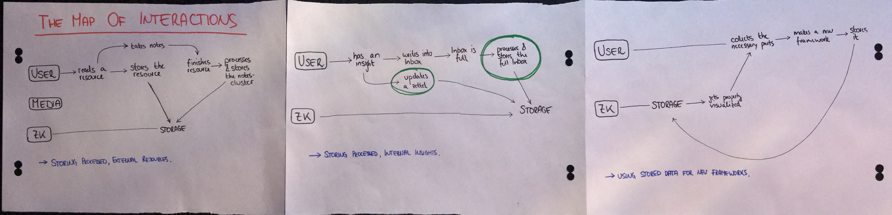

## The PIS And The ZK
The PIS and the ZK are two entities, roughly adhering to backend and frontend. While the PIS manages all the data of the ZK (with graph stuff) the ZK displays and organizes the data appropriately.  

## Long Term Goal

Create a better workflow for storing data, processing knowledge & producing new frameworks  

## (Pessismistic) Questions To Keep In Mind
- Won't this be too much overhead?
- Should we incorporate learning methods into the workflow passively?
- How can we make the workflow as simple as possible yet robust?  
- What's the brain's job in all of this?  
(feels like its thinking/working is pretty much narrowed down)

## Map of Interactions

## Storyboard For First Chosen Interaction

